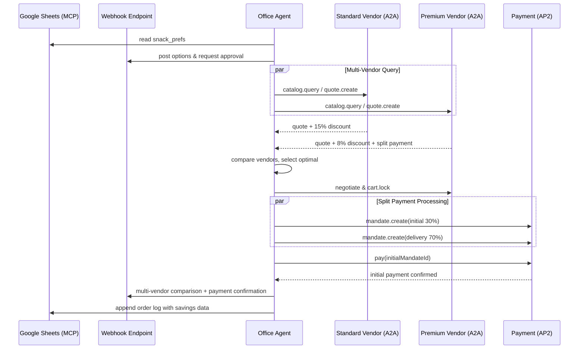

# Snack Bot — MCP + A2A + AP2 End-to-End Demo

An agent that:
1. Reads team headcount & snack prefs via **MCP** (Sheets + Webhook),
2. Negotiates with **multiple vendor agents** via **A2A** for best pricing,
3. Supports **split payments** (initial + delivery) using signed **AP2** mandates.

---

## Table of Contents
- [Snack Bot — MCP + A2A + AP2 End-to-End Demo](#snack-bot--mcp--a2a--ap2-end-to-end-demo)
  - [Table of Contents](#table-of-contents)
  - [Goals](#goals)
  - [Architecture](#architecture)
  - [Directory Layout](#directory-layout)
  - [Quickstart (Mocks Only)](#quickstart-mocks-only)
  - [Running With Real Integrations](#running-with-real-integrations)
    - [MCP: Google Sheets](#mcp-google-sheets)
    - [Webhook Notifications](#webhook-notifications)
  - [Environment](#environment)
  - [Data Models (JSON Schemas)](#data-models-json-schemas)
    - [A2A Cart](#a2a-cart)
    - [AP2 Mandate](#ap2-mandate)
  - [OpenAPI: A2A \& AP2](#openapi-a2a--ap2)
    - [A2A](#a2a)
    - [AP2](#ap2)
  - [Reference Flows](#reference-flows)
  - [Claude Prompts](#claude-prompts)
  - [Make \& NPM Scripts](#make--npm-scripts)
  - [Testing \& E2E](#testing--e2e)
  - [Security, Audit, and Ops](#security-audit-and-ops)
  - [Troubleshooting](#troubleshooting)
  - [Roadmap](#roadmap)
  - [License](#license)

---

## Goals
- Minimal, realistic **E2E** demo of MCP + A2A + AP2.
- Local dev works fully with mocks.
- OpenAPI specs for Claude/codegen.
- HTTP+JSON transport, schema-driven.

---

## Architecture



---

## Directory Layout

```
/snack-bot/
  apps/
    office-agent/
      src/
        mcp/            # Sheets + Webhook clients
        a2a/            # A2A client
        ap2/            # AP2 client + signer
        flows/          # collect → approve → negotiate → pay
        store/          # audit logs, local kv
      .env.example
      package.json
    vendor-agent/
      src/
        a2a_server/     # catalog, quote, negotiate, cart.lock
        ap2_acceptor/   # verify mandate, simulate settlement
      package.json
  openapi/
    a2a.yaml
    ap2.yaml
  infra/
    docker-compose.yml
  docs/
    sequence.md
    schemas.md
```

---

## Quickstart (Mocks Only)

```bash
git clone https://github.com/shrivatsas/snack-bot
cd snack-bot

# Office agent
cd apps/office-agent
cp .env.example .env
npm install
npm run dev

# Multi-vendor setup using Docker (recommended)
make docker-up

# Or run vendors separately:
cd ../vendor-agent
npm install
npm run dev        # Standard vendor (port 4000)
npm run dev:premium # Premium vendor (port 4001)
```

This runs with local mocks for Sheets/Webhook notifications.

---

## Running With Real Integrations

### MCP: Google Sheets
- Create a sheet with `name, dietary, budget`.
- Configure MCP server with `SHEET_ID`.

### Webhook Notifications
- Use webhook.site, ngrok, or any HTTP endpoint.
- Add `WEBHOOK_URL` to `.env` (no authentication required).

---

## Environment

`.env.example`:

```bash
SHEET_ID=1BxiMVs0XRA5nFMdKvBdBZjgmUUqptlbs74OgvE2upms
WEBHOOK_URL=https://webhook.site/your-unique-url
VENDOR_AGENT_URL=http://localhost:4000
PREMIUM_VENDOR_URL=http://localhost:4001
PAYMENT_AGENT_URL=http://localhost:5001
PRIVATE_KEY_PATH=./keys/dev_ed25519.pem
PORT=3000
```

---

## Data Models (JSON Schemas)

### A2A Multi-Vendor Quote
```json
{
  "vendorComparison": {
    "quotesReceived": 2,
    "selectedVendor": "Premium Foods Co.",
    "savings": 15.50,
    "percentageSaved": 8.2
  },
  "cart": {
    "cartId": "string",
    "total": 2700,
    "lineItems": [
      {"sku": "gourmet-nuts-001", "qty": 5, "price": 280}
    ],
    "deliveryWindow": "2025-09-26T14:00-15:00"
  }
}
```

### AP2 Split Payment Mandate
```json
{
  "initialPayment": {
    "mandateId": "mandate_initial_001",
    "amount": 810,
    "percentage": 30,
    "signature": "base64_initial"
  },
  "deliveryPayment": {
    "mandateId": "mandate_delivery_001",
    "amount": 1890,
    "percentage": 70,
    "signature": "base64_delivery"
  },
  "cartId": "string",
  "payerRef": "TEAM-OPS-001",
  "ttl": "2025-09-26T10:00Z"
}
```

---

## OpenAPI: A2A & AP2

### A2A
`openapi/a2a.yaml` defines:
- `POST /a2a/catalog.query`
- `POST /a2a/quote.create`
- `POST /a2a/negotiate`
- `POST /a2a/cart.lock`

### AP2
`openapi/ap2.yaml` defines:
- `POST /ap2/mandate.create`
- `POST /ap2/pay`
- `GET /ap2/payment.status`

---

## Reference Flows

1. **Collect context (MCP)** → read team preferences from sheet.
2. **Multi-vendor query (A2A)** → simultaneously query multiple vendor catalogs.
3. **Compare & select (A2A)** → analyze quotes, negotiate, select optimal vendor.
4. **Split payment (AP2)** → create initial (30%) + delivery (70%) mandates.
5. **Process payment (AP2)** → execute initial payment, schedule delivery payment.
6. **Notify (Webhook)** → send vendor comparison + payment confirmation.

---

## Claude Prompts

```text
Generate a TypeScript client from openapi/a2a.yaml
Generate a TypeScript client from openapi/ap2.yaml
Generate OfficeAgent orchestrator using mcp/, a2a/, ap2/
```

---

## Make & NPM Scripts

- `npm run dev` → start local dev server
- `npm test` → run unit tests
- `make build` → build Docker images
- `make demo` → run complete MCP + A2A + AP2 demo flow
- `make health` → check all service health endpoints

### Demo Output Example

```bash
$ make demo
🚀 Starting Snack Bot Demo: MCP + A2A + AP2 Integration
==================================================

📋 Demo Flow Overview:
1. MCP: Read team preferences from Google Sheets
2. A2A: Query catalogs from MULTIPLE vendors simultaneously
3. A2A: Compare quotes and negotiate with best vendor
4. A2A: Lock cart with selected vendor
5. AP2: Process SPLIT PAYMENT (initial + delivery)
6. AP2: Create delivery payment mandate for later
7. Webhook: Send multi-vendor comparison notifications

🔄 Executing end-to-end flow...
----------------------------------------
{
  "success": true,
  "cartId": "cart_1727356234567_abc123",
  "paymentId": "payment_1727356234890_xyz789",
  "deliveryMandateId": "mandate_delivery_1727356235123",
  "total": 127.50,
  "initialPayment": 38.25,
  "deliveryPayment": 89.25,
  "selectedVendor": "Premium Foods Co.",
  "vendorComparison": {
    "quotesReceived": 2,
    "savings": 18.75,
    "percentageSaved": 12.8
  }
}

📊 Data Flow Analysis:
=====================
✅ Multi-Vendor Transaction Successful!
   Selected Vendor: Premium Foods Co.
   Cart ID: cart_1727356234567_abc123
   Total Amount: $127.50
   💰 Split Payment:
     Initial Payment: $38.25 (ID: payment_1727356234890_xyz789)
     Delivery Payment: $89.25 (Mandate: mandate_delivery_1727356235123)

🔍 Service Health Check:
------------------------
• Office Agent (MCP): ok
• Standard Vendor (A2A): ok
• Premium Vendor (A2A): ok
• Payment Service (AP2): ok
• Webhook Endpoint: ok

📈 Key Data Points Exchanged:
-----------------------------
• MCP (Sheets): 5 team members, $135 total budget
• A2A (Multi-Vendor): 7 + 7 products from 2 vendors
• A2A (Negotiation): Multi-vendor price comparison completed
• AP2 (Split Payment): 38.25 + 89.25 payment structure
• AP2 (Mandates): Ed25519-signed initial + delivery mandates
• Webhook: Multi-vendor notifications with comparison data

🏆 Vendor Comparison Results:
-----------------------------
• Quotes Received: 2 vendors competed
• Cost Savings: $18.75 saved vs. highest quote
• Savings Percentage: 12.8% saved by selecting best vendor
• Winner: Premium Foods Co. selected for best value

🎉 Demo completed successfully! All protocols integrated.
```

---

## Testing & E2E

- Use Jest/Mocha for unit tests.
- Add integration tests simulating:
  - MCP sheet fetch
  - Webhook notification mock
  - Vendor negotiation mock
  - AP2 mandate + pay

---

## Security, Audit, and Ops

- Keys: store Ed25519 private key outside repo.
- Audit: persist A2A transcripts + AP2 mandates.
- Scopes: limit MCP server access.

---

## Troubleshooting

- **Payment fails:** Check keypair + signature format.
- **Webhook not posting:** Validate webhook URL endpoint.
- **Sheet not found:** Ensure `SHEET_ID` is correct.

---

## Roadmap

- ✅ Multi-vendor A2A with price comparison
- ✅ Split payment processing (initial + delivery)
- Auto-reorders with standing AP2 mandates
- Integration with real payment rails
- Dynamic vendor discovery and onboarding

---

## License

MIT License © 2025 Your Org
