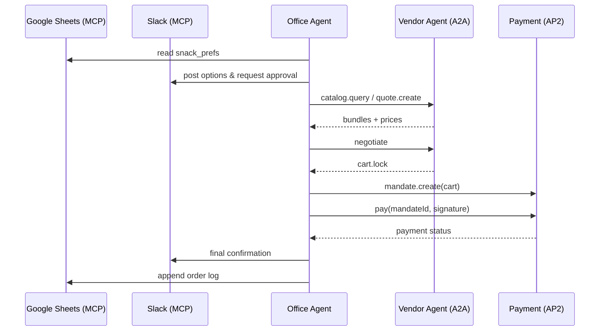

# Snack Bot — MCP + A2A + AP2 End-to-End Demo

An agent that:
1. Reads team headcount & snack prefs via **MCP** (Sheets + Slack),
2. Negotiates with a vendor agent via **A2A**, and
3. Pays using a signed **AP2** mandate.

---

## Table of Contents
- [Snack Bot — MCP + A2A + AP2 End-to-End Demo](#snack-bot--mcp--a2a--ap2-end-to-end-demo)
  - [Table of Contents](#table-of-contents)
  - [Goals](#goals)
  - [Architecture](#architecture)
  - [Directory Layout](#directory-layout)
  - [Quickstart (Mocks Only)](#quickstart-mocks-only)
  - [Running With Real Integrations](#running-with-real-integrations)
    - [MCP: Google Sheets](#mcp-google-sheets)
    - [MCP: Slack](#mcp-slack)
  - [Environment](#environment)
  - [Data Models (JSON Schemas)](#data-models-json-schemas)
    - [A2A Cart](#a2a-cart)
    - [AP2 Mandate](#ap2-mandate)
  - [OpenAPI: A2A \& AP2](#openapi-a2a--ap2)
    - [A2A](#a2a)
    - [AP2](#ap2)
  - [Reference Flows](#reference-flows)
  - [Claude Prompts](#claude-prompts)
  - [Make \& NPM Scripts](#make--npm-scripts)
  - [Testing \& E2E](#testing--e2e)
  - [Security, Audit, and Ops](#security-audit-and-ops)
  - [Troubleshooting](#troubleshooting)
  - [Roadmap](#roadmap)
  - [License](#license)

---

## Goals
- Minimal, realistic **E2E** demo of MCP + A2A + AP2.
- Local dev works fully with mocks.
- OpenAPI specs for Claude/codegen.
- HTTP+JSON transport, schema-driven.

---

## Architecture



---

## Directory Layout

```
/snack-bot/
  apps/
    office-agent/
      src/
        mcp/            # Sheets + Slack clients
        a2a/            # A2A client
        ap2/            # AP2 client + signer
        flows/          # collect → approve → negotiate → pay
        store/          # audit logs, local kv
      .env.example
      package.json
    vendor-agent/
      src/
        a2a_server/     # catalog, quote, negotiate, cart.lock
        ap2_acceptor/   # verify mandate, simulate settlement
      package.json
  openapi/
    a2a.yaml
    ap2.yaml
  infra/
    docker-compose.yml
  docs/
    sequence.md
    schemas.md
```

---

## Quickstart (Mocks Only)

```bash
git clone https://github.com/shrivatsas/snack-bot
cd snack-bot

# Office agent
cd apps/office-agent
cp .env.example .env
npm install
npm run dev

# Vendor agent (mock)
cd ../vendor-agent
npm install
npm run dev
```

This runs with local mocks for Sheets/Slack.

---

## Running With Real Integrations

### MCP: Google Sheets
- Create a sheet with `name, dietary, budget`.
- Configure MCP server with `SHEET_ID`.

### MCP: Slack
- Create an incoming webhook.
- Add `SLACK_WEBHOOK_URL` to `.env`.

---

## Environment

`.env.example`:

```bash
SHEET_ID=...
SLACK_WEBHOOK_URL=...
VENDOR_AGENT_URL=http://localhost:4000
PAYMENT_AGENT_URL=http://localhost:5000
PRIVATE_KEY_PATH=./keys/dev_ed25519.pem
```

---

## Data Models (JSON Schemas)

### A2A Cart
```json
{
  "cartId": "string",
  "total": 2700,
  "lineItems": [
    {"sku": "snack-veg-001", "qty": 10, "price": 100}
  ],
  "deliveryWindow": "2025-09-26T14:00-15:00"
}
```

### AP2 Mandate
```json
{
  "mandateId": "string",
  "cartId": "string",
  "payerRef": "TEAM-OPS-001",
  "ttl": "2025-09-26T10:00Z",
  "signature": "base64"
}
```

---

## OpenAPI: A2A & AP2

### A2A
`openapi/a2a.yaml` defines:
- `POST /a2a/catalog.query`
- `POST /a2a/quote.create`
- `POST /a2a/negotiate`
- `POST /a2a/cart.lock`

### AP2
`openapi/ap2.yaml` defines:
- `POST /ap2/mandate.create`
- `POST /ap2/pay`
- `GET /ap2/payment.status`

---

## Reference Flows

1. **Collect context (MCP)** → read sheet.
2. **Propose (MCP)** → post options to Slack.
3. **Negotiate (A2A)** → vendor bundles → counteroffers → lock cart.
4. **Pay (AP2)** → create + sign mandate, submit payment.
5. **Notify (MCP)** → Slack + append to sheet.

---

## Claude Prompts

```text
Generate a TypeScript client from openapi/a2a.yaml
Generate a TypeScript client from openapi/ap2.yaml
Generate OfficeAgent orchestrator using mcp/, a2a/, ap2/
```

---

## Make & NPM Scripts

- `npm run dev` → start local dev server
- `npm test` → run unit tests
- `make build` → build Docker images

---

## Testing & E2E

- Use Jest/Mocha for unit tests.
- Add integration tests simulating:
  - MCP sheet fetch
  - Slack approval mock
  - Vendor negotiation mock
  - AP2 mandate + pay

---

## Security, Audit, and Ops

- Keys: store Ed25519 private key outside repo.
- Audit: persist A2A transcripts + AP2 mandates.
- Scopes: limit MCP server access.

---

## Troubleshooting

- **Payment fails:** Check keypair + signature format.
- **Slack not posting:** Validate webhook URL.
- **Sheet not found:** Ensure `SHEET_ID` is correct.

---

## Roadmap

- Multi-vendor A2A.
- Auto-reorders with standing AP2 mandates.
- Integration with real payment rails.

---

## License

MIT License © 2025 Your Org
