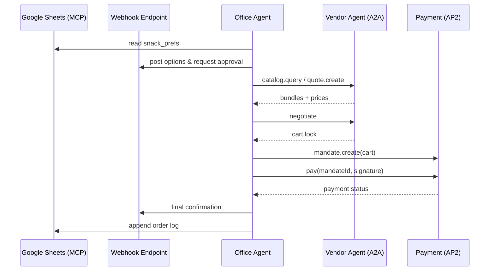

# Snack Bot — MCP + A2A + AP2 End-to-End Demo

An agent that:
1. Reads team headcount & snack prefs via **MCP** (Sheets + Webhook),
2. Negotiates with a vendor agent via **A2A**, and
3. Pays using a signed **AP2** mandate.

---

## Table of Contents
- [Snack Bot — MCP + A2A + AP2 End-to-End Demo](#snack-bot--mcp--a2a--ap2-end-to-end-demo)
  - [Table of Contents](#table-of-contents)
  - [Goals](#goals)
  - [Architecture](#architecture)
  - [Directory Layout](#directory-layout)
  - [Quickstart (Mocks Only)](#quickstart-mocks-only)
  - [Running With Real Integrations](#running-with-real-integrations)
    - [MCP: Google Sheets](#mcp-google-sheets)
    - [Webhook Notifications](#webhook-notifications)
  - [Environment](#environment)
  - [Data Models (JSON Schemas)](#data-models-json-schemas)
    - [A2A Cart](#a2a-cart)
    - [AP2 Mandate](#ap2-mandate)
  - [OpenAPI: A2A \& AP2](#openapi-a2a--ap2)
    - [A2A](#a2a)
    - [AP2](#ap2)
  - [Reference Flows](#reference-flows)
  - [Claude Prompts](#claude-prompts)
  - [Make \& NPM Scripts](#make--npm-scripts)
  - [Testing \& E2E](#testing--e2e)
  - [Security, Audit, and Ops](#security-audit-and-ops)
  - [Troubleshooting](#troubleshooting)
  - [Roadmap](#roadmap)
  - [License](#license)

---

## Goals
- Minimal, realistic **E2E** demo of MCP + A2A + AP2.
- Local dev works fully with mocks.
- OpenAPI specs for Claude/codegen.
- HTTP+JSON transport, schema-driven.

---

## Architecture



---

## Directory Layout

```
/snack-bot/
  apps/
    office-agent/
      src/
        mcp/            # Sheets + Webhook clients
        a2a/            # A2A client
        ap2/            # AP2 client + signer
        flows/          # collect → approve → negotiate → pay
        store/          # audit logs, local kv
      .env.example
      package.json
    vendor-agent/
      src/
        a2a_server/     # catalog, quote, negotiate, cart.lock
        ap2_acceptor/   # verify mandate, simulate settlement
      package.json
  openapi/
    a2a.yaml
    ap2.yaml
  infra/
    docker-compose.yml
  docs/
    sequence.md
    schemas.md
```

---

## Quickstart (Mocks Only)

```bash
git clone https://github.com/shrivatsas/snack-bot
cd snack-bot

# Office agent
cd apps/office-agent
cp .env.example .env
npm install
npm run dev

# Vendor agent (mock)
cd ../vendor-agent
npm install
npm run dev
```

This runs with local mocks for Sheets/Webhook notifications.

---

## Running With Real Integrations

### MCP: Google Sheets
- Create a sheet with `name, dietary, budget`.
- Configure MCP server with `SHEET_ID`.

### Webhook Notifications
- Use webhook.site, ngrok, or any HTTP endpoint.
- Add `WEBHOOK_URL` to `.env` (no authentication required).

---

## Environment

`.env.example`:

```bash
SHEET_ID=1BxiMVs0XRA5nFMdKvBdBZjgmUUqptlbs74OgvE2upms
WEBHOOK_URL=https://webhook.site/your-unique-url
VENDOR_AGENT_URL=http://localhost:4000
PAYMENT_AGENT_URL=http://localhost:5001
PRIVATE_KEY_PATH=./keys/dev_ed25519.pem
PORT=3000
```

---

## Data Models (JSON Schemas)

### A2A Cart
```json
{
  "cartId": "string",
  "total": 2700,
  "lineItems": [
    {"sku": "snack-veg-001", "qty": 10, "price": 100}
  ],
  "deliveryWindow": "2025-09-26T14:00-15:00"
}
```

### AP2 Mandate
```json
{
  "mandateId": "string",
  "cartId": "string",
  "payerRef": "TEAM-OPS-001",
  "ttl": "2025-09-26T10:00Z",
  "signature": "base64"
}
```

---

## OpenAPI: A2A & AP2

### A2A
`openapi/a2a.yaml` defines:
- `POST /a2a/catalog.query`
- `POST /a2a/quote.create`
- `POST /a2a/negotiate`
- `POST /a2a/cart.lock`

### AP2
`openapi/ap2.yaml` defines:
- `POST /ap2/mandate.create`
- `POST /ap2/pay`
- `GET /ap2/payment.status`

---

## Reference Flows

1. **Collect context (MCP)** → read sheet.
2. **Propose (Webhook)** → post options to webhook endpoint.
3. **Negotiate (A2A)** → vendor bundles → counteroffers → lock cart.
4. **Pay (AP2)** → create + sign mandate, submit payment.
5. **Notify (Webhook)** → webhook endpoint + append to sheet.

---

## Claude Prompts

```text
Generate a TypeScript client from openapi/a2a.yaml
Generate a TypeScript client from openapi/ap2.yaml
Generate OfficeAgent orchestrator using mcp/, a2a/, ap2/
```

---

## Make & NPM Scripts

- `npm run dev` → start local dev server
- `npm test` → run unit tests
- `make build` → build Docker images
- `make demo` → run complete MCP + A2A + AP2 demo flow
- `make health` → check all service health endpoints

### Demo Output Example

```bash
$ make demo
🚀 Starting Snack Bot Demo: MCP + A2A + AP2 Integration
==================================================

📋 Demo Flow Overview:
1. MCP: Read team preferences from Google Sheets
2. A2A: Query vendor catalog and create quote
3. A2A: Negotiate pricing and lock cart
4. AP2: Create payment mandate with Ed25519 signature
5. AP2: Process payment and confirm
6. Webhook: Send notifications throughout flow

🔄 Executing end-to-end flow...
----------------------------------------
{
  "success": true,
  "cartId": "cart_1758862976962_7tswtqdys",
  "paymentId": "payment_1758862977161_p45mz09od",
  "total": 80,
  "steps": [
    "Connecting to MCP services",
    "Reading team preferences from sheets",
    "Analyzed team: 5 members, budget $135",
    "Querying vendor catalog via A2A",
    "Sending snack options for team approval",
    "Creating quote with vendor",
    "Requesting approval for quote",
    "Locking cart for payment",
    "Creating payment mandate via AP2",
    "Processing payment with signed mandate",
    "Waiting for payment confirmation",
    "Sending payment confirmation",
    "Logging order to sheets"
  ]
}

📊 Data Flow Analysis:
=====================
✅ Transaction Successful!
   Cart ID: cart_1758862976962_7tswtqdys
   Payment ID: payment_1758862977161_p45mz09od
   Total Amount: $80

🔍 Service Health Check:
------------------------
• Office Agent (MCP): ok
• Vendor Agent (A2A): ok
• Payment Service (AP2): ok
• Webhook Endpoint: ok

📈 Key Data Points Exchanged:
-----------------------------
• MCP (Sheets): 5 team members, $135 total budget
• A2A (Catalog): 7 available products queried
• A2A (Quote): Quote created and cart locked for payment
• AP2 (Mandate): Ed25519-signed payment mandate created
• AP2 (Payment): Payment processed and confirmed
• Webhook: 4+ notifications sent (options, approval, confirmation, completion)

🎉 Demo completed successfully! All protocols integrated.
```

---

## Testing & E2E

- Use Jest/Mocha for unit tests.
- Add integration tests simulating:
  - MCP sheet fetch
  - Webhook notification mock
  - Vendor negotiation mock
  - AP2 mandate + pay

---

## Security, Audit, and Ops

- Keys: store Ed25519 private key outside repo.
- Audit: persist A2A transcripts + AP2 mandates.
- Scopes: limit MCP server access.

---

## Troubleshooting

- **Payment fails:** Check keypair + signature format.
- **Webhook not posting:** Validate webhook URL endpoint.
- **Sheet not found:** Ensure `SHEET_ID` is correct.

---

## Roadmap

- Multi-vendor A2A.
- Auto-reorders with standing AP2 mandates.
- Integration with real payment rails.

---

## License

MIT License © 2025 Your Org
