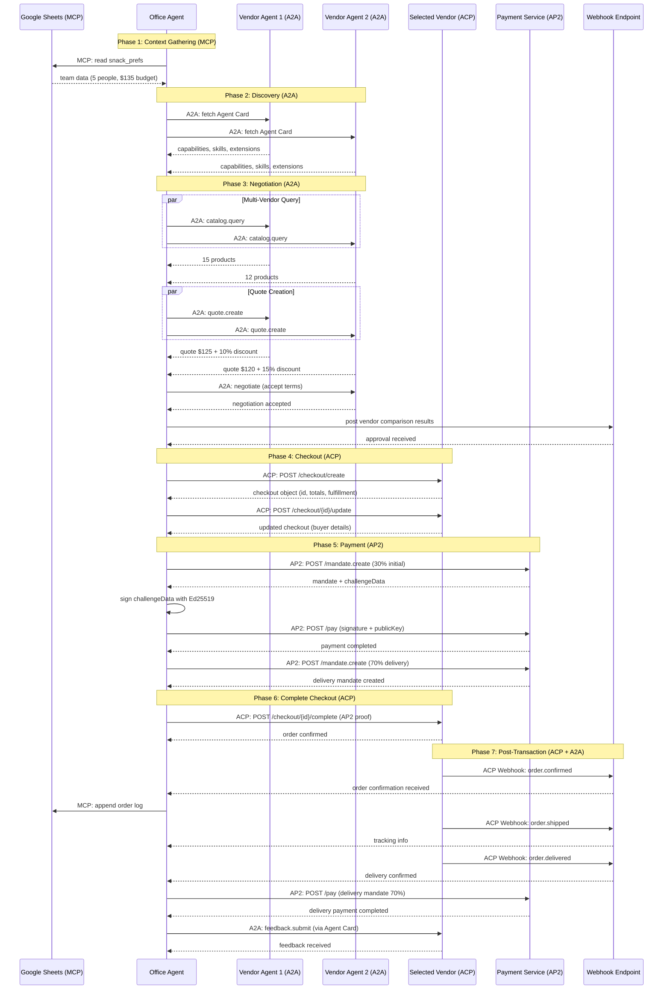

# Multi-Protocol Integration Design: MCP + A2A + ACP + AP2

**Project:** Snack Bot
**Document Version:** 2.0
**Date:** 2025-10-11
**Status:** Design Proposal

---

## Table of Contents

- [Executive Summary](#executive-summary)
- [Protocol Overview](#protocol-overview)
  - [MCP - Model Context Protocol](#mcp---model-context-protocol)
  - [A2A - Agent-to-Agent Protocol](#a2a---agent-to-agent-protocol)
  - [ACP - Agentic Commerce Protocol](#acp---agentic-commerce-protocol)
  - [AP2 - Agent Payments Protocol](#ap2---agent-payments-protocol)
- [Integration Architecture](#integration-architecture)
  - [Protocol Interaction Flow](#protocol-interaction-flow)
  - [Phase-by-Phase Breakdown](#phase-by-phase-breakdown)
- [Enhanced Transaction Flow](#enhanced-transaction-flow)
- [Implementation Design](#implementation-design)
  - [1. Agent Card Discovery (A2A)](#1-agent-card-discovery-a2a)
  - [2. ACP Checkout Integration](#2-acp-checkout-integration)
  - [3. AP2 Payment with ACP](#3-ap2-payment-with-acp)
  - [4. A2A Post-Transaction Communication](#4-a2a-post-transaction-communication)
  - [5. MCP Server Enhancement](#5-mcp-server-enhancement)
- [Technical Specifications](#technical-specifications)
  - [Protocol Handoff Points](#protocol-handoff-points)
  - [Data Model Mapping](#data-model-mapping)
  - [API Endpoints](#api-endpoints)
- [Sequence Diagrams](#sequence-diagrams)
- [Implementation Roadmap](#implementation-roadmap)
- [Benefits of Multi-Protocol Integration](#benefits-of-multi-protocol-integration)
- [Decision Points](#decision-points)
- [References](#references)

---

## Executive Summary

This document outlines a comprehensive integration strategy for combining four industry-standard protocols in the Snack Bot project:

- **MCP (Model Context Protocol)** - Anthropic's protocol for AI data source integration
- **A2A (Agent-to-Agent Protocol)** - Google's protocol for agent communication and negotiation
- **ACP (Agentic Commerce Protocol)** - OpenAI/Stripe's protocol for standardized commerce checkout
- **AP2 (Agent Payments Protocol)** - Google's protocol for secure agent-driven payments

### Key Insight: Protocol Separation of Concerns

Each protocol serves a distinct purpose in the transaction lifecycle:

| Protocol | Purpose | Phase | Owner |
|----------|---------|-------|-------|
| **MCP** | Data source access | Pre-transaction | Anthropic |
| **A2A** | Agent discovery, negotiation, communication | Discovery & Negotiation | Google |
| **ACP** | Standardized checkout flow | Checkout | OpenAI/Stripe |
| **AP2** | Secure payment processing | Payment | Google |

### Integration Strategy

Instead of replacing protocols, we **compose** them:

1. **MCP** reads team preferences from Google Sheets
2. **A2A** handles vendor discovery, catalog queries, and price negotiation
3. **ACP** standardizes the checkout experience once a vendor is selected
4. **AP2** processes payments with verifiable digital credentials
5. **A2A** continues for post-transaction communication (tracking, support)

**Timeline:** 4 weeks across 3 implementation phases
**Complexity:** Medium - protocols are complementary, not overlapping

---

## Protocol Overview

### MCP - Model Context Protocol

**Owner:** Anthropic
**Purpose:** Enable AI assistants to securely access data sources and tools

**Key Features:**
- Server-client architecture for exposing data sources
- Tool definitions for AI-callable functions
- Resource schemas for structured data
- JSON-RPC 2.0 over stdio or HTTP

**Snack Bot Usage:**
- Read team preferences from Google Sheets
- Webhook notifications for approvals
- Future: Database access, API integrations

**Official Docs:** [modelcontextprotocol.io](https://modelcontextprotocol.io)

---

### A2A - Agent-to-Agent Protocol

**Owner:** Google (open-source, Apache 2.0)
**Purpose:** Enable communication and interoperability between AI agents

**Key Features:**
- **Agent Cards:** JSON metadata describing agent capabilities, skills, endpoints
- **JSON-RPC 2.0:** Request/response format for agent communication
- **Server-Sent Events (SSE):** For long-running tasks and async responses
- **Security:** HTTPS transport, OAuth 2.0, API keys

**Core Operations:**
- `discover` - Find agents and their capabilities
- `negotiate` - Multi-turn negotiation between agents
- `task.execute` - Execute skills/tasks on remote agents
- `status` - Check task status for long-running operations

**Snack Bot Usage:**
- Vendor agent discovery via Agent Cards
- Catalog querying and quote creation
- Multi-turn price negotiation
- Cart locking and order confirmation
- Post-transaction communication (tracking, support)

**Official Docs:** [a2a-protocol.org](https://a2a-protocol.org)

---

### ACP - Agentic Commerce Protocol

**Owner:** OpenAI + Stripe (open-source, Apache 2.0)
**Purpose:** Standardize commerce transactions between AI agents and businesses

**Key Features:**
- **Standardized Checkout Flow:** Create → Update → Complete → Cancel
- **Rich Product Metadata:** Line items, pricing, fulfillment options
- **Payment Abstraction:** SharedPaymentToken for payment method independence
- **Webhooks:** Order lifecycle events (confirmed, shipped, delivered)
- **Merchant Control:** Businesses control products, pricing, fulfillment

**Snack Bot Usage:**
- Transition from A2A negotiation to standardized checkout
- Unified checkout experience across all vendors
- Integration with ChatGPT/Claude for direct purchases
- Webhook-based order status updates

**Official Docs:** [agenticcommerce.dev](https://www.agenticcommerce.dev)

---

### AP2 - Agent Payments Protocol

**Owner:** Google (60+ partners: Mastercard, PayPal, Adyen)
**Purpose:** Enable secure, verifiable agent-driven payments

**Key Features:**
- **Verifiable Digital Credentials (VDCs):** Cryptographically signed mandates
- **Three Mandate Types:**
  - **Intent Mandate:** Pre-authorized spending limits (human-not-present)
  - **Cart Mandate:** Explicit cart authorization (human-present)
  - **Payment Mandate:** Shared with payment networks
- **Cryptographic Signatures:** Ed25519 for non-repudiation
- **Payment Agnostic:** Works with cards, bank transfers, crypto

**Snack Bot Usage:**
- Create Cart Mandate for explicit user authorization
- Sign payment with Ed25519 private key
- Support split payments (30% initial, 70% on delivery)
- Verifiable audit trail for compliance

**Official Docs:** [ap2-protocol.org](https://ap2-protocol.org)

---

## Integration Architecture

### Protocol Interaction Flow

```
┌─────────────────────────────────────────────────────────────────────┐
│                         SNACK BOT TRANSACTION                        │
└─────────────────────────────────────────────────────────────────────┘

┌──────────┐  ┌──────────┐  ┌──────────┐  ┌──────────┐  ┌──────────┐
│   MCP    │  │   A2A    │  │   ACP    │  │   AP2    │  │   A2A    │
│  Phase   │─▶│Discovery │─▶│ Checkout │─▶│ Payment  │─▶│Post-Txn  │
│          │  │   +      │  │          │  │          │  │          │
│ Read     │  │Negotiate │  │ Create   │  │ Mandate  │  │ Track    │
│ Prefs    │  │          │  │ Update   │  │ Sign     │  │ Support  │
│          │  │          │  │ Complete │  │ Execute  │  │          │
└──────────┘  └──────────┘  └──────────┘  └──────────┘  └──────────┘
```

### Phase-by-Phase Breakdown

#### Phase 1: Context Gathering (MCP)
**Protocol:** MCP
**Participants:** Office Agent ↔ Google Sheets MCP Server

**Operations:**
1. Office agent connects to Google Sheets via MCP
2. Reads team snack preferences (name, dietary, budget)
3. Aggregates requirements for vendor queries

**Output:** Team requirements object
```json
{
  "headcount": 5,
  "totalBudget": 135,
  "dietary": ["vegan", "gluten-free"],
  "categories": ["nuts", "chips", "fruit"]
}
```

---

#### Phase 2: Agent Discovery (A2A)
**Protocol:** A2A
**Participants:** Office Agent ↔ Multiple Vendor Agents

**Operations:**
1. Office agent discovers vendor agents via A2A registry
2. Fetches **Agent Cards** from each vendor
3. Validates vendor capabilities (skills, supported operations)

**Agent Card Example:**
```json
{
  "@context": "https://a2a-protocol.org/v1",
  "id": "urn:uuid:vendor-premium-001",
  "name": "Premium Foods Co.",
  "description": "Premium organic snack vendor",
  "url": "https://vendor-premium.example.com",
  "skills": [
    {
      "name": "catalog.query",
      "description": "Query product catalog with filters"
    },
    {
      "name": "quote.create",
      "description": "Create price quote for items"
    },
    {
      "name": "negotiate",
      "description": "Negotiate pricing and terms"
    }
  ],
  "authentication": {
    "type": "bearer",
    "tokenEndpoint": "https://vendor-premium.example.com/oauth/token"
  },
  "extensions": {
    "supportsACP": true,
    "supportsAP2": true
  }
}
```

---

#### Phase 3: Negotiation (A2A)
**Protocol:** A2A
**Participants:** Office Agent ↔ Multiple Vendor Agents (parallel)

**Operations:**
1. Office agent queries catalogs via A2A `catalog.query`
2. Creates quotes via A2A `quote.create`
3. Negotiates pricing via A2A `negotiate` (multi-turn)
4. Compares quotes and selects best vendor

**A2A Negotiation Flow:**
```json
// Request
{
  "jsonrpc": "2.0",
  "method": "negotiate",
  "params": {
    "quoteId": "quote_abc123",
    "counterOffer": {
      "targetTotal": 120.00,
      "adjustedItems": [
        { "sku": "nuts-001", "newQuantity": 4 }
      ],
      "notes": "Can you match this price for bulk order?"
    }
  },
  "id": 1
}

// Response
{
  "jsonrpc": "2.0",
  "result": {
    "accepted": true,
    "revisedQuote": {
      "quoteId": "quote_abc123_rev1",
      "total": 120.00,
      "discount": 15.00,
      "lineItems": [...]
    },
    "message": "Accepted! 15% bulk discount applied."
  },
  "id": 1
}
```

---

#### Phase 4: Checkout (ACP)
**Protocol:** ACP
**Participants:** Office Agent ↔ Selected Vendor (ACP Server)

**Why switch to ACP here?**
- A2A handled discovery and negotiation (agent-specific)
- ACP provides **standardized checkout** (merchant-friendly)
- ACP checkout works with ChatGPT, Claude, other assistants
- ACP webhooks provide order lifecycle events

**Operations:**
1. Office agent creates ACP checkout with negotiated quote
2. Vendor returns checkout object with line items, totals, fulfillment options
3. Office agent updates checkout with buyer details, selected fulfillment
4. Vendor prepares for payment

**ACP Checkout Creation:**
```json
// POST /acp/checkout/create
{
  "lineItems": [
    { "sku": "nuts-001", "quantity": 4 },
    { "sku": "chips-002", "quantity": 5 }
  ],
  "buyer": {
    "name": "Office Team",
    "email": "team@example.com"
  },
  "metadata": {
    "a2aQuoteId": "quote_abc123_rev1",
    "negotiatedDiscount": 15.00
  }
}

// Response
{
  "checkout": {
    "id": "checkout_xyz789",
    "status": "open",
    "lineItems": [
      {
        "id": "item_1",
        "sku": "nuts-001",
        "name": "Premium Mixed Nuts",
        "quantity": 4,
        "price": { "amount": 25.00, "currency": "USD" }
      },
      {
        "id": "item_2",
        "sku": "chips-002",
        "name": "Organic Veggie Chips",
        "quantity": 5,
        "price": { "amount": 18.00, "currency": "USD" }
      }
    ],
    "totals": {
      "subtotal": 190.00,
      "discount": 15.00,
      "tax": 15.75,
      "shipping": 10.00,
      "total": 210.75,
      "currency": "USD"
    },
    "supportedPaymentMethods": ["ap2_mandate", "shared_payment_token"],
    "fulfillmentOptions": [
      {
        "id": "next_day",
        "type": "delivery",
        "description": "Next-Day Delivery",
        "cost": 10.00,
        "estimatedDelivery": "2025-10-12T14:00-16:00"
      }
    ],
    "expiresAt": "2025-10-11T12:00:00Z"
  }
}
```

---

#### Phase 5: Payment (AP2)
**Protocol:** AP2
**Participants:** Office Agent ↔ Payment Service ↔ Vendor

**Why use AP2 instead of ACP's SharedPaymentToken?**
- AP2 provides **verifiable digital credentials** (VDCs)
- Cryptographic proof of authorization (non-repudiable)
- Supports **split payments** (30% now, 70% on delivery)
- Google's payment network integrations (Mastercard, PayPal, etc.)
- Works alongside ACP as payment method

**Operations:**
1. Office agent creates **Cart Mandate** via AP2 (explicit authorization)
2. Signs mandate with Ed25519 private key
3. Passes signed mandate to ACP checkout completion
4. Vendor verifies signature and processes payment
5. Second mandate created for delivery payment (70%)

**AP2 Cart Mandate Creation:**
```json
// POST /ap2/mandate.create
{
  "type": "cart_mandate",
  "cartId": "checkout_xyz789",
  "payerRef": "TEAM-OPS-001",
  "amount": 63.23,  // 30% of total (210.75 * 0.30)
  "currency": "USD",
  "ttl": "2025-10-11T12:00:00Z",
  "metadata": {
    "checkoutId": "checkout_xyz789",
    "paymentPlan": "split_30_70",
    "phase": "initial"
  }
}

// Response
{
  "mandateId": "mandate_initial_001",
  "cartId": "checkout_xyz789",
  "payerRef": "TEAM-OPS-001",
  "amount": 63.23,
  "currency": "USD",
  "ttl": "2025-10-11T12:00:00Z",
  "challengeData": "eyJhbGciOi...",  // Data to sign
  "created": "2025-10-11T10:00:00Z"
}
```

**Sign and Execute Payment:**
```json
// POST /ap2/pay
{
  "mandateId": "mandate_initial_001",
  "signature": "Q3JlYXRpdm...",  // Ed25519 signature of challengeData
  "publicKey": "MCowBQYDK2..."    // Ed25519 public key
}

// Response
{
  "paymentId": "payment_001",
  "status": "completed",
  "amount": 63.23,
  "transactionRef": "txn_mastercard_12345",
  "processed": "2025-10-11T10:01:00Z"
}
```

---

#### Phase 6: Checkout Completion (ACP)
**Protocol:** ACP
**Participants:** Office Agent → Vendor (ACP Server)

**Operations:**
1. Office agent completes ACP checkout with AP2 payment proof
2. Vendor validates AP2 signature and processes order
3. Vendor emits ACP webhook: `order.confirmed`
4. Office agent receives order confirmation

**ACP Checkout Completion:**
```json
// POST /acp/checkout/checkout_xyz789/complete
{
  "paymentToken": "ap2://mandate_initial_001/payment_001",
  "paymentMethod": "ap2_mandate",
  "paymentProof": {
    "protocol": "ap2",
    "mandateId": "mandate_initial_001",
    "paymentId": "payment_001",
    "signature": "Q3JlYXRpdm...",
    "publicKey": "MCowBQYDK2..."
  }
}

// Response
{
  "order": {
    "id": "order_xyz789",
    "checkoutId": "checkout_xyz789",
    "status": "confirmed",
    "lineItems": [...],
    "totals": { "total": 210.75, "currency": "USD" },
    "payment": {
      "method": "ap2_mandate",
      "status": "partially_paid",
      "amountPaid": 63.23,
      "amountDue": 147.52,  // 70% due on delivery
      "pendingMandateId": "mandate_delivery_002"
    },
    "fulfillment": {
      "type": "delivery",
      "estimatedDelivery": "2025-10-12T14:00-16:00",
      "trackingNumber": "1Z999AA10123456784"
    }
  }
}
```

---

#### Phase 7: Post-Transaction (A2A + ACP Webhooks)
**Protocol:** A2A + ACP
**Participants:** Vendor → Office Agent

**Why both protocols?**
- **ACP Webhooks:** Standardized order lifecycle events (shipped, delivered)
- **A2A:** Agent-to-agent communication for issues, changes, support

**ACP Webhook Example:**
```json
// Vendor sends webhook
POST https://office-agent.example.com/acp/webhooks
X-ACP-Signature: sha256=abc123...
X-ACP-Timestamp: 1696867200

{
  "id": "evt_001",
  "type": "order.delivered",
  "created": "2025-10-12T16:30:00Z",
  "data": {
    "object": {
      "orderId": "order_xyz789",
      "status": "delivered",
      "deliveredAt": "2025-10-12T16:30:00Z",
      "signedBy": "Office Manager"
    }
  },
  "vendor": {
    "id": "vendor-premium-001",
    "name": "Premium Foods Co."
  }
}
```

**Office Agent Handler:**
```typescript
// On order.delivered webhook
async function handleOrderDelivered(event: ACPWebhookEvent) {
  const order = event.data.object;

  // Execute delivery payment (70%) via AP2
  const deliveryPayment = await ap2Client.pay({
    mandateId: order.payment.pendingMandateId,
    signature: signChallengeData(deliveryMandate.challengeData),
    publicKey: process.env.ED25519_PUBLIC_KEY
  });

  // Notify team via MCP webhook
  await webhookClient.notify({
    message: `Order ${order.orderId} delivered! Payment complete.`,
    amount: order.totals.total,
    vendor: event.vendor.name
  });

  // Use A2A to send feedback to vendor
  await a2aClient.execute({
    agentId: event.vendor.id,
    skill: "feedback.submit",
    params: {
      orderId: order.orderId,
      rating: 5,
      comment: "Great service, thank you!"
    }
  });
}
```

---

## Enhanced Transaction Flow

### Complete Sequence Diagram



---

## Implementation Design

### 1. Agent Card Discovery (A2A)

**Goal:** Enable dynamic vendor discovery via A2A Agent Cards

**Implementation:**

**Agent Card Server (Vendor Agent):**
```typescript
// apps/vendor-agent/src/a2a/agent-card.ts

export interface AgentCard {
  "@context": "https://a2a-protocol.org/v1";
  id: string;
  name: string;
  description: string;
  url: string;
  skills: AgentSkill[];
  authentication: AuthConfig;
  extensions: {
    supportsACP: boolean;
    supportsAP2: boolean;
    acpEndpoint?: string;
    ap2Endpoint?: string;
  };
}

export class AgentCardServer {
  async getAgentCard(): Promise<AgentCard> {
    return {
      "@context": "https://a2a-protocol.org/v1",
      id: process.env.VENDOR_ID,
      name: process.env.VENDOR_NAME,
      description: "Premium organic snack vendor with ACP checkout support",
      url: process.env.VENDOR_URL,
      skills: [
        {
          name: "catalog.query",
          description: "Query product catalog with dietary filters",
          inputSchema: CatalogQuerySchema,
          outputSchema: CatalogResponseSchema
        },
        {
          name: "quote.create",
          description: "Create price quote for selected items",
          inputSchema: QuoteRequestSchema,
          outputSchema: QuoteResponseSchema
        },
        {
          name: "negotiate",
          description: "Multi-turn price negotiation",
          inputSchema: NegotiationRequestSchema,
          outputSchema: NegotiationResponseSchema
        }
      ],
      authentication: {
        type: "bearer",
        tokenEndpoint: `${process.env.VENDOR_URL}/oauth/token`
      },
      extensions: {
        supportsACP: true,
        supportsAP2: true,
        acpEndpoint: `${process.env.VENDOR_URL}/acp`,
        ap2Endpoint: `${process.env.VENDOR_URL}/ap2`
      }
    };
  }
}

// Serve agent card
app.get("/.well-known/agent-card", async (req, res) => {
  const card = await agentCardServer.getAgentCard();
  res.json(card);
});
```

**Agent Discovery Client (Office Agent):**
```typescript
// apps/office-agent/src/a2a/discovery.ts

export class VendorDiscovery {
  async discoverVendors(vendorUrls: string[]): Promise<AgentCard[]> {
    const cards = await Promise.all(
      vendorUrls.map(url => this.fetchAgentCard(url))
    );
    return cards.filter(card =>
      card.extensions.supportsACP && card.extensions.supportsAP2
    );
  }

  async fetchAgentCard(vendorUrl: string): Promise<AgentCard> {
    const response = await fetch(`${vendorUrl}/.well-known/agent-card`);
    if (!response.ok) {
      throw new Error(`Failed to fetch agent card from ${vendorUrl}`);
    }
    return await response.json();
  }

  validateCapabilities(card: AgentCard): boolean {
    const requiredSkills = ["catalog.query", "quote.create"];
    return requiredSkills.every(skill =>
      card.skills.some(s => s.name === skill)
    );
  }
}
```

---

### 2. ACP Checkout Integration

**Goal:** Add ACP checkout endpoints to vendor agents, integrate with existing A2A flow

**Architecture Decision:**
- **A2A endpoints** remain for negotiation (`/a2a/*`)
- **ACP endpoints** added for checkout (`/acp/*`)
- **Handoff point:** After `negotiate` completes, office agent switches to ACP

**ACP Checkout Server (Vendor Agent):**
```typescript
// apps/vendor-agent/src/acp/checkout.ts

export class ACPCheckoutServer {
  async createCheckout(request: CreateCheckoutRequest): Promise<CheckoutResponse> {
    // If request includes a2aQuoteId, import negotiated terms
    const quote = request.metadata?.a2aQuoteId
      ? await this.quoteStore.get(request.metadata.a2aQuoteId)
      : null;

    const lineItems = await this.resolveLineItems(
      request.lineItems,
      quote?.lineItems
    );

    const totals = this.calculateTotals(lineItems, quote?.discount);

    const checkout: Checkout = {
      id: generateId("checkout"),
      status: "open",
      lineItems,
      totals,
      supportedPaymentMethods: ["ap2_mandate", "shared_payment_token"],
      fulfillmentOptions: await this.getFulfillmentOptions(),
      buyer: request.buyer,
      metadata: {
        ...request.metadata,
        a2aQuoteId: quote?.quoteId
      },
      createdAt: new Date().toISOString(),
      updatedAt: new Date().toISOString(),
      expiresAt: addMinutes(new Date(), 30).toISOString()
    };

    await this.checkoutStore.save(checkout);
    return { checkout };
  }

  async completeCheckout(
    checkoutId: string,
    request: CompleteCheckoutRequest
  ): Promise<OrderResponse> {
    const checkout = await this.checkoutStore.get(checkoutId);

    // Verify AP2 payment proof
    if (request.paymentMethod === "ap2_mandate") {
      const verified = await this.verifyAP2Payment(request.paymentProof);
      if (!verified) {
        throw new Error("AP2 payment verification failed");
      }
    }

    // Create order
    const order: Order = {
      id: generateId("order"),
      checkoutId,
      status: "confirmed",
      lineItems: checkout.lineItems,
      totals: checkout.totals,
      buyer: checkout.buyer,
      payment: {
        method: request.paymentMethod,
        status: request.paymentProof.amountDue > 0
          ? "partially_paid"
          : "paid",
        amountPaid: request.paymentProof.amountPaid,
        amountDue: request.paymentProof.amountDue,
        pendingMandateId: request.paymentProof.deliveryMandateId
      },
      fulfillment: {
        type: "delivery",
        estimatedDelivery: checkout.fulfillmentOptions[0].estimatedDelivery,
        trackingNumber: generateTrackingNumber()
      },
      createdAt: new Date().toISOString()
    };

    await this.orderStore.save(order);

    // Emit ACP webhook
    await this.webhookSender.send({
      type: "order.confirmed",
      data: { object: order },
      vendorId: process.env.VENDOR_ID
    });

    return { order };
  }

  async verifyAP2Payment(proof: PaymentProof): Promise<boolean> {
    // Verify Ed25519 signature
    const mandate = await ap2Client.getMandate(proof.mandateId);
    const isValid = verifySignature(
      proof.publicKey,
      mandate.challengeData,
      proof.signature
    );

    // Verify payment exists
    const payment = await ap2Client.getPaymentStatus(proof.paymentId);
    const isPaid = payment.status === "completed";

    return isValid && isPaid;
  }
}
```

**ACP Checkout Client (Office Agent):**
```typescript
// apps/office-agent/src/acp/client.ts

export class ACPCheckoutClient {
  async createCheckoutFromQuote(
    vendorCard: AgentCard,
    quote: A2AQuote
  ): Promise<Checkout> {
    const endpoint = vendorCard.extensions.acpEndpoint;

    const response = await fetch(`${endpoint}/checkout/create`, {
      method: "POST",
      headers: {
        "Content-Type": "application/json",
        "Authorization": `Bearer ${await this.getToken(vendorCard)}`
      },
      body: JSON.stringify({
        lineItems: quote.lineItems.map(item => ({
          sku: item.sku,
          quantity: item.quantity
        })),
        buyer: {
          name: "Office Team",
          email: process.env.TEAM_EMAIL
        },
        metadata: {
          a2aQuoteId: quote.quoteId,
          negotiatedDiscount: quote.discount
        }
      })
    });

    const data = await response.json();
    return data.checkout;
  }

  async completeCheckout(
    vendorCard: AgentCard,
    checkoutId: string,
    ap2Payment: AP2PaymentResult
  ): Promise<Order> {
    const endpoint = vendorCard.extensions.acpEndpoint;

    const response = await fetch(`${endpoint}/checkout/${checkoutId}/complete`, {
      method: "POST",
      headers: {
        "Content-Type": "application/json",
        "Authorization": `Bearer ${await this.getToken(vendorCard)}`
      },
      body: JSON.stringify({
        paymentToken: `ap2://${ap2Payment.mandateId}/${ap2Payment.paymentId}`,
        paymentMethod: "ap2_mandate",
        paymentProof: {
          protocol: "ap2",
          mandateId: ap2Payment.mandateId,
          paymentId: ap2Payment.paymentId,
          signature: ap2Payment.signature,
          publicKey: ap2Payment.publicKey,
          amountPaid: ap2Payment.amountPaid,
          amountDue: ap2Payment.amountDue,
          deliveryMandateId: ap2Payment.deliveryMandateId
        }
      })
    });

    const data = await response.json();
    return data.order;
  }
}
```

---

### 3. AP2 Payment with ACP

**Goal:** Use AP2 for payment processing within ACP checkout flow

**AP2 Payment Orchestrator:**
```typescript
// apps/office-agent/src/ap2/orchestrator.ts

export class AP2PaymentOrchestrator {
  async createSplitPayment(
    checkout: Checkout,
    splitRatio: { initial: number; delivery: number }
  ): Promise<SplitPaymentResult> {
    const initialAmount = checkout.totals.total * splitRatio.initial;
    const deliveryAmount = checkout.totals.total * splitRatio.delivery;

    // Create initial payment mandate (30%)
    const initialMandate = await this.ap2Client.createMandate({
      type: "cart_mandate",
      cartId: checkout.id,
      payerRef: process.env.PAYER_REF,
      amount: initialAmount,
      currency: checkout.totals.currency,
      ttl: checkout.expiresAt,
      metadata: {
        checkoutId: checkout.id,
        paymentPlan: "split_30_70",
        phase: "initial"
      }
    });

    // Sign and execute initial payment
    const initialPayment = await this.executePayment(initialMandate);

    // Create delivery payment mandate (70%) - executed later
    const deliveryMandate = await this.ap2Client.createMandate({
      type: "cart_mandate",
      cartId: checkout.id,
      payerRef: process.env.PAYER_REF,
      amount: deliveryAmount,
      currency: checkout.totals.currency,
      ttl: addDays(new Date(), 7).toISOString(),
      metadata: {
        checkoutId: checkout.id,
        paymentPlan: "split_30_70",
        phase: "delivery"
      }
    });

    return {
      initialPayment: {
        mandateId: initialMandate.mandateId,
        paymentId: initialPayment.paymentId,
        amount: initialAmount,
        signature: initialPayment.signature,
        publicKey: this.getPublicKey()
      },
      deliveryMandate: {
        mandateId: deliveryMandate.mandateId,
        amount: deliveryAmount
      }
    };
  }

  async executePayment(mandate: Mandate): Promise<PaymentResult> {
    // Sign challenge data with Ed25519 private key
    const signature = this.signChallengeData(mandate.challengeData);

    // Execute payment
    const payment = await this.ap2Client.pay({
      mandateId: mandate.mandateId,
      signature,
      publicKey: this.getPublicKey()
    });

    return {
      paymentId: payment.paymentId,
      signature,
      status: payment.status
    };
  }

  private signChallengeData(challengeData: string): string {
    const privateKey = this.loadPrivateKey();
    const message = Buffer.from(challengeData, "base64");
    const signature = nacl.sign.detached(message, privateKey);
    return Buffer.from(signature).toString("base64");
  }

  private loadPrivateKey(): Uint8Array {
    const keyPath = process.env.ED25519_PRIVATE_KEY_PATH;
    const keyData = fs.readFileSync(keyPath, "utf8");
    // Parse PEM format and extract raw key bytes
    return parseEd25519PrivateKey(keyData);
  }

  private getPublicKey(): string {
    const publicKeyPath = process.env.ED25519_PUBLIC_KEY_PATH;
    const keyData = fs.readFileSync(publicKeyPath, "utf8");
    return Buffer.from(parseEd25519PublicKey(keyData)).toString("base64");
  }
}
```

**Vendor-Side AP2 Verification:**
```typescript
// apps/vendor-agent/src/ap2/verifier.ts

export class AP2PaymentVerifier {
  async verifyPayment(proof: PaymentProof): Promise<VerificationResult> {
    // 1. Fetch mandate from AP2 service
    const mandate = await this.ap2Client.getMandate(proof.mandateId);

    // 2. Verify mandate hasn't expired
    if (new Date(mandate.ttl) < new Date()) {
      return { valid: false, reason: "Mandate expired" };
    }

    // 3. Verify signature
    const publicKey = Buffer.from(proof.publicKey, "base64");
    const message = Buffer.from(mandate.challengeData, "base64");
    const signature = Buffer.from(proof.signature, "base64");

    const isValidSignature = nacl.sign.detached.verify(
      message,
      signature,
      publicKey
    );

    if (!isValidSignature) {
      return { valid: false, reason: "Invalid signature" };
    }

    // 4. Verify payment was executed
    const payment = await this.ap2Client.getPaymentStatus(proof.paymentId);
    if (payment.status !== "completed") {
      return { valid: false, reason: `Payment status: ${payment.status}` };
    }

    // 5. Verify amounts match
    if (payment.amount !== mandate.amount) {
      return { valid: false, reason: "Amount mismatch" };
    }

    return {
      valid: true,
      mandate,
      payment
    };
  }
}
```

---

### 4. A2A Post-Transaction Communication

**Goal:** Use A2A for ongoing communication after checkout (tracking, support, feedback)

**Post-Transaction Skills (Vendor Agent):**
```typescript
// apps/vendor-agent/src/a2a/post-transaction-skills.ts

export class PostTransactionSkills {
  @A2ASkill("order.track")
  async trackOrder(params: { orderId: string }): Promise<TrackingInfo> {
    const order = await this.orderStore.get(params.orderId);

    return {
      orderId: params.orderId,
      status: order.status,
      trackingNumber: order.fulfillment.trackingNumber,
      carrier: order.fulfillment.carrier,
      estimatedDelivery: order.fulfillment.estimatedDelivery,
      lastUpdate: order.updatedAt,
      events: await this.getTrackingEvents(order.fulfillment.trackingNumber)
    };
  }

  @A2ASkill("order.modify")
  async modifyOrder(params: {
    orderId: string;
    changes: OrderChanges;
  }): Promise<ModificationResult> {
    const order = await this.orderStore.get(params.orderId);

    // Only allow modifications if order hasn't shipped
    if (order.status !== "confirmed") {
      return {
        success: false,
        message: "Order has already shipped, cannot modify"
      };
    }

    // Apply changes
    const updatedOrder = await this.applyOrderChanges(order, params.changes);
    await this.orderStore.save(updatedOrder);

    // Emit ACP webhook
    await this.webhookSender.send({
      type: "order.updated",
      data: { object: updatedOrder }
    });

    return {
      success: true,
      updatedOrder
    };
  }

  @A2ASkill("feedback.submit")
  async submitFeedback(params: {
    orderId: string;
    rating: number;
    comment: string;
  }): Promise<void> {
    await this.feedbackStore.save({
      orderId: params.orderId,
      rating: params.rating,
      comment: params.comment,
      submittedAt: new Date().toISOString()
    });

    console.log(`Feedback received for order ${params.orderId}: ${params.rating}/5`);
  }

  @A2ASkill("support.request")
  async requestSupport(params: {
    orderId: string;
    issue: string;
    priority: "low" | "medium" | "high";
  }): Promise<SupportTicket> {
    const ticket = await this.supportSystem.createTicket({
      orderId: params.orderId,
      issue: params.issue,
      priority: params.priority
    });

    return {
      ticketId: ticket.id,
      status: "open",
      estimatedResponse: addHours(new Date(), 24).toISOString()
    };
  }
}
```

**Office Agent Post-Transaction Client:**
```typescript
// apps/office-agent/src/a2a/post-transaction.ts

export class PostTransactionClient {
  async trackOrder(vendorCard: AgentCard, orderId: string): Promise<TrackingInfo> {
    return await this.a2aClient.executeSkill({
      agentCard: vendorCard,
      skill: "order.track",
      params: { orderId }
    });
  }

  async submitFeedback(
    vendorCard: AgentCard,
    orderId: string,
    rating: number,
    comment: string
  ): Promise<void> {
    await this.a2aClient.executeSkill({
      agentCard: vendorCard,
      skill: "feedback.submit",
      params: { orderId, rating, comment }
    });
  }

  async requestSupport(
    vendorCard: AgentCard,
    orderId: string,
    issue: string
  ): Promise<SupportTicket> {
    return await this.a2aClient.executeSkill({
      agentCard: vendorCard,
      skill: "support.request",
      params: { orderId, issue, priority: "medium" }
    });
  }
}
```

---

### 5. MCP Server Enhancement

**Goal:** Expose vendor operations via MCP for Claude/ChatGPT integration

**MCP Server with Multi-Protocol Support:**
```typescript
// apps/vendor-agent/src/mcp/server.ts

export class VendorMCPServer {
  private a2aServer: A2AServer;
  private acpServer: ACPCheckoutServer;

  setupTools() {
    return [
      {
        name: "search_vendor_catalog",
        description: "Search vendor catalog using A2A protocol",
        inputSchema: {
          type: "object",
          properties: {
            categories: { type: "array", items: { type: "string" } },
            dietary: { type: "array", items: { type: "string" } },
            maxBudget: { type: "number" }
          },
          required: ["categories"]
        }
      },
      {
        name: "create_quote",
        description: "Create price quote using A2A protocol",
        inputSchema: {
          type: "object",
          properties: {
            items: {
              type: "array",
              items: {
                type: "object",
                properties: {
                  sku: { type: "string" },
                  quantity: { type: "number" }
                }
              }
            }
          },
          required: ["items"]
        }
      },
      {
        name: "create_acp_checkout",
        description: "Create ACP checkout session for quote",
        inputSchema: {
          type: "object",
          properties: {
            quoteId: { type: "string" },
            buyerEmail: { type: "string" }
          },
          required: ["quoteId"]
        }
      },
      {
        name: "complete_checkout_with_ap2",
        description: "Complete checkout using AP2 payment",
        inputSchema: {
          type: "object",
          properties: {
            checkoutId: { type: "string" },
            splitPayment: { type: "boolean", default: true }
          },
          required: ["checkoutId"]
        }
      }
    ];
  }

  async handleToolCall(name: string, params: any) {
    switch (name) {
      case "search_vendor_catalog":
        return await this.a2aServer.catalogQuery(params);

      case "create_quote":
        return await this.a2aServer.createQuote(params);

      case "create_acp_checkout":
        const quote = await this.quoteStore.get(params.quoteId);
        return await this.acpServer.createCheckout({
          lineItems: quote.lineItems,
          buyer: { email: params.buyerEmail },
          metadata: { a2aQuoteId: params.quoteId }
        });

      case "complete_checkout_with_ap2":
        // Orchestrate AP2 payment + ACP completion
        const checkout = await this.checkoutStore.get(params.checkoutId);
        const payment = await this.ap2Orchestrator.createSplitPayment(
          checkout,
          { initial: 0.30, delivery: 0.70 }
        );
        return await this.acpServer.completeCheckout(
          params.checkoutId,
          {
            paymentMethod: "ap2_mandate",
            paymentProof: payment
          }
        );

      default:
        throw new Error(`Unknown tool: ${name}`);
    }
  }
}
```

---

## Technical Specifications

### Protocol Handoff Points

| Phase | From Protocol | To Protocol | Trigger | Data Passed |
|-------|--------------|-------------|---------|-------------|
| Discovery → Negotiation | - | A2A | Office agent starts | Vendor URLs |
| Negotiation → Checkout | A2A | ACP | Quote accepted | Quote ID, line items |
| Checkout → Payment | ACP | AP2 | Checkout created | Checkout ID, total amount |
| Payment → Complete | AP2 | ACP | Payment executed | Payment proof, mandate ID |
| Complete → Post-Txn | ACP | A2A | Order created | Order ID, tracking info |

### Data Model Mapping

**A2A Quote → ACP Checkout:**
```typescript
function mapQuoteToCheckout(quote: A2AQuote): CreateCheckoutRequest {
  return {
    lineItems: quote.lineItems.map(item => ({
      sku: item.sku,
      quantity: item.quantity
    })),
    metadata: {
      a2aQuoteId: quote.quoteId,
      negotiatedDiscount: quote.discount,
      negotiatedTotal: quote.total
    }
  };
}
```

**ACP Checkout → AP2 Mandate:**
```typescript
function mapCheckoutToMandate(
  checkout: Checkout,
  percentage: number
): MandateRequest {
  return {
    type: "cart_mandate",
    cartId: checkout.id,
    payerRef: process.env.PAYER_REF,
    amount: checkout.totals.total * percentage,
    currency: checkout.totals.currency,
    ttl: checkout.expiresAt,
    metadata: {
      checkoutId: checkout.id,
      percentage: percentage * 100
    }
  };
}
```

**AP2 Payment → ACP Completion:**
```typescript
function mapPaymentToCompletion(
  initialPayment: PaymentResult,
  deliveryMandate: Mandate
): CompleteCheckoutRequest {
  return {
    paymentToken: `ap2://${initialPayment.mandateId}/${initialPayment.paymentId}`,
    paymentMethod: "ap2_mandate",
    paymentProof: {
      protocol: "ap2",
      mandateId: initialPayment.mandateId,
      paymentId: initialPayment.paymentId,
      signature: initialPayment.signature,
      publicKey: getPublicKey(),
      amountPaid: initialPayment.amount,
      amountDue: deliveryMandate.amount,
      deliveryMandateId: deliveryMandate.mandateId
    }
  };
}
```

### API Endpoints

**Vendor Agent Endpoints:**
```
# A2A Protocol
GET    /.well-known/agent-card              # Agent discovery
POST   /a2a/catalog.query                   # A2A catalog query
POST   /a2a/quote.create                    # A2A quote creation
POST   /a2a/negotiate                       # A2A negotiation
POST   /a2a/skill/{skillName}               # A2A skill execution (generic)

# ACP Protocol
POST   /acp/checkout/create                 # ACP checkout creation
GET    /acp/checkout/{id}                   # ACP checkout retrieval
POST   /acp/checkout/{id}/update            # ACP checkout update
POST   /acp/checkout/{id}/complete          # ACP checkout completion
POST   /acp/checkout/{id}/cancel            # ACP checkout cancellation

# AP2 Protocol
POST   /ap2/mandate.create                  # AP2 mandate creation
POST   /ap2/pay                             # AP2 payment execution
GET    /ap2/payment.status                  # AP2 payment status

# MCP Protocol
stdio  vendor-mcp-server                    # MCP tool server
```

**Office Agent Endpoints:**
```
# ACP Webhooks
POST   /acp/webhooks                        # ACP webhook receiver

# MCP Tools
stdio  office-mcp-client                    # MCP client for sheets
```

---

## Sequence Diagrams

### Discovery + Negotiation (A2A)
```
Office Agent          Vendor 1 (A2A)         Vendor 2 (A2A)
     |                      |                      |
     |--GET /.well-known/agent-card-------------->|
     |<-----Agent Card (capabilities)-------------|
     |                      |                      |
     |--GET /.well-known/agent-card-------------->|
     |<-----Agent Card (capabilities)-------------|
     |                      |                      |
     |--POST /a2a/catalog.query------------------>|
     |--POST /a2a/catalog.query-------------------+->|
     |<-----15 products-----------------------------|
     |<-----12 products-----------------------------+--|
     |                      |                      |
     |--POST /a2a/quote.create-------------------->|
     |--POST /a2a/quote.create--------------------+->|
     |<-----Quote $125 (10% discount)---------------|
     |<-----Quote $120 (15% discount)---------------+--|
     |                      |                      |
     | [Compare quotes, select Vendor 2]          |
     |                      |                      |
     |--POST /a2a/negotiate-----------------------+->|
     |<-----Negotiation accepted-------------------+--|
```

### Checkout + Payment (ACP + AP2)
```
Office Agent     Vendor (ACP)     AP2 Service     Webhook
     |                |                |             |
     |--POST /acp/checkout/create---->|             |
     |<-----Checkout object-----------|             |
     |                |                |             |
     |--POST /ap2/mandate.create----->|------------>|
     |<-----Mandate + challengeData---|<------------|
     |                |                |             |
     | [Sign challengeData]           |             |
     |                |                |             |
     |--POST /ap2/pay (signature)---->|------------>|
     |<-----Payment completed---------|<------------|
     |                |                |             |
     |--POST /acp/checkout/complete-->|             |
     |   (AP2 payment proof)          |             |
     |<-----Order confirmed-----------|             |
     |                |                |             |
     |                |--Webhook: order.confirmed-->|
     |<-----------------------------------------------------|
```

---

## Implementation Roadmap

### Phase 1: A2A Agent Cards + ACP Foundation (Week 1-2)

**Week 1: A2A Agent Card Implementation**
- [ ] Implement Agent Card server in vendor-agent
- [ ] Add agent card discovery client in office-agent
- [ ] Define vendor skills (catalog.query, quote.create, negotiate)
- [ ] Add `supportsACP` and `supportsAP2` flags to extensions
- [ ] Test multi-vendor discovery

**Week 2: ACP Checkout Endpoints**
- [ ] Implement ACP checkout endpoints in vendor-agent (`/acp/*`)
- [ ] Add ACP client in office-agent
- [ ] Implement A2A → ACP handoff (quote → checkout mapping)
- [ ] Test checkout creation from A2A quote
- [ ] Validate ACP responses against OpenAPI spec

**Deliverables:**
- Agent Cards served at `/.well-known/agent-card`
- ACP checkout endpoints functional
- Office agent can discover vendors and create ACP checkouts

---

### Phase 2: AP2 Payment Integration (Week 2-3)

**Week 2-3: AP2 Integration**
- [ ] Implement AP2 mandate creation (Cart Mandate)
- [ ] Add Ed25519 signature generation
- [ ] Create split payment orchestrator (30% initial, 70% delivery)
- [ ] Implement ACP checkout completion with AP2 proof
- [ ] Add AP2 signature verification in vendor-agent
- [ ] Test full flow: A2A quote → ACP checkout → AP2 payment

**Deliverables:**
- Split payment working (30/70)
- AP2 signatures verified successfully
- ACP checkout completes with AP2 payment proof

---

### Phase 3: Post-Transaction & MCP (Week 3-4)

**Week 3: ACP Webhooks + A2A Post-Transaction**
- [ ] Implement ACP webhook sender in vendor-agent
- [ ] Add webhook receiver in office-agent
- [ ] Handle `order.confirmed`, `order.shipped`, `order.delivered` events
- [ ] Trigger delivery payment (70%) on `order.delivered` webhook
- [ ] Implement A2A post-transaction skills (track, support, feedback)

**Week 4: MCP Server Enhancement**
- [ ] Create MCP server exposing A2A + ACP operations
- [ ] Add MCP tools: search_catalog, create_quote, create_checkout
- [ ] Test MCP server with Claude Desktop
- [ ] Update documentation with MCP integration guide

**Deliverables:**
- Webhooks delivering order events
- Delivery payment triggered automatically
- MCP server accessible from Claude Desktop

---

## Benefits of Multi-Protocol Integration

### 1. Best-of-Breed Protocol Usage

| Protocol | Strength | Use Case in Snack Bot |
|----------|----------|----------------------|
| **MCP** | AI-to-data integration | Read team preferences from Google Sheets |
| **A2A** | Agent communication | Discover vendors, negotiate pricing |
| **ACP** | Standardized commerce | Checkout flow compatible with ChatGPT/Claude |
| **AP2** | Secure payments | Verifiable digital credentials, split payments |

### 2. Ecosystem Interoperability

**A2A Ecosystem:**
- Google Agent Engine integration
- Multi-agent marketplaces
- Cross-vendor negotiation

**ACP Ecosystem:**
- ChatGPT Instant Checkout
- Claude Shopping Assistant
- Stripe payment integration

**AP2 Ecosystem:**
- Mastercard, PayPal, Adyen support
- Google Pay integration
- Multi-currency payments

**MCP Ecosystem:**
- Anthropic Claude Desktop
- OpenAI ChatGPT (future MCP support)
- 3rd-party MCP servers (databases, APIs)

### 3. Separation of Concerns

Each protocol handles what it does best:
- **A2A:** Agent-specific negotiation logic
- **ACP:** Merchant-friendly checkout standardization
- **AP2:** Payment security and compliance
- **MCP:** Data source abstraction

### 4. Future-Proofing

- **New payment methods:** Add to AP2 without changing A2A/ACP
- **New checkout features:** Update ACP without changing A2A/AP2
- **New vendors:** Onboard via A2A Agent Cards
- **New data sources:** Add MCP servers without changing agents

---

## Decision Points

### Decision 1: Protocol Versions
**Question:** Which protocol versions to target?

**Recommendation:**
- **A2A:** v1.0 (latest stable)
- **ACP:** 2025-09-29 (official spec)
- **AP2:** v1.0 (latest stable)
- **MCP:** 2024-11-05 (latest stable)

**Rationale:** Use latest stable versions, version endpoints for future upgrades

---

### Decision 2: Agent Card Extensions
**Question:** What custom extensions should Agent Cards include?

**Recommendation:**
```json
{
  "extensions": {
    "supportsACP": true,
    "supportsAP2": true,
    "acpEndpoint": "https://vendor.example.com/acp",
    "ap2Endpoint": "https://vendor.example.com/ap2",
    "paymentMethods": ["ap2_mandate", "shared_payment_token"],
    "fulfillmentTypes": ["delivery", "pickup"],
    "supportsNegotiation": true,
    "supportsSplitPayment": true
  }
}
```

**Rationale:** Office agent can filter vendors by capabilities before querying

---

### Decision 3: Checkout Transition Timing
**Question:** When to transition from A2A to ACP?

**Options:**
- A) After catalog query (early transition)
- B) After quote creation (mid transition)
- C) After negotiation accepted (late transition)

**Recommendation:** Option C (after negotiation)

**Rationale:**
- A2A is optimized for multi-turn negotiation
- ACP is optimized for standardized checkout
- Transition after negotiation is complete

---

### Decision 4: Payment Method Priority
**Question:** Should AP2 be the primary payment method or fallback?

**Recommendation:** Primary payment method, with ACP SharedPaymentToken as fallback

**Rationale:**
- AP2 provides stronger security guarantees (VDCs)
- Supports split payments natively
- Better audit trail for compliance
- SharedPaymentToken for vendors not supporting AP2

---

### Decision 5: MCP Tool Granularity
**Question:** Should MCP expose low-level operations or high-level workflows?

**Recommendation:** Both - expose individual protocol operations AND composed workflows

**Example:**
```typescript
// Low-level
tools: [
  "a2a_catalog_query",
  "a2a_create_quote",
  "acp_create_checkout",
  "ap2_create_mandate"
]

// High-level (composed)
tools: [
  "purchase_snacks",  // Orchestrates A2A + ACP + AP2 end-to-end
  "track_order"       // Uses A2A post-transaction skills
]
```

**Rationale:** Low-level tools for flexibility, high-level for ease of use

---

## References

### Official Protocol Documentation

**MCP (Model Context Protocol)**
- Website: [modelcontextprotocol.io](https://modelcontextprotocol.io)
- Spec: [spec.modelcontextprotocol.io](https://spec.modelcontextprotocol.io)
- GitHub: [github.com/modelcontextprotocol/specification](https://github.com/modelcontextprotocol/specification)

**A2A (Agent-to-Agent Protocol)**
- Website: [a2a-protocol.org](https://a2a-protocol.org)
- Spec: [a2a-protocol.org/dev/specification](https://a2a-protocol.org/dev/specification)
- GitHub: [github.com/a2aproject/A2A](https://github.com/a2aproject/A2A)
- Google Blog: [developers.googleblog.com/en/a2a-a-new-era-of-agent-interoperability](https://developers.googleblog.com/en/a2a-a-new-era-of-agent-interoperability/)

**ACP (Agentic Commerce Protocol)**
- Website: [agenticcommerce.dev](https://www.agenticcommerce.dev)
- OpenAI Docs: [developers.openai.com/commerce](https://developers.openai.com/commerce)
- Stripe Docs: [docs.stripe.com/agentic-commerce/protocol](https://docs.stripe.com/agentic-commerce/protocol)
- GitHub: [github.com/agentic-commerce-protocol/agentic-commerce-protocol](https://github.com/agentic-commerce-protocol/agentic-commerce-protocol)
- OpenAPI Spec: [github.com/agentic-commerce-protocol/agentic-commerce-protocol/blob/main/spec/openapi/openapi.agentic_checkout.yaml](https://github.com/agentic-commerce-protocol/agentic-commerce-protocol/blob/main/spec/openapi/openapi.agentic_checkout.yaml)

**AP2 (Agent Payments Protocol)**
- Website: [ap2-protocol.org](https://ap2-protocol.org)
- Spec: [ap2-protocol.org/specification](https://ap2-protocol.org/specification)
- GitHub: [github.com/google-agentic-commerce/AP2](https://github.com/google-agentic-commerce/AP2)
- PayPal Blog: [developer.paypal.com/community/blog/PayPal-Agent-Payments-Protocol](https://developer.paypal.com/community/blog/PayPal-Agent-Payments-Protocol/)

### Integration Guides

- "What Every AI Engineer Should Know About A2A, MCP & ACP" - Medium: [medium.com/@elisowski/what-every-ai-engineer-should-know-about-a2a-mcp-acp-8335a210a742](https://medium.com/@elisowski/what-every-ai-engineer-should-know-about-a2a-mcp-acp-8335a210a742)
- "Agentic Payments Explained: ACP, AP2, and x402" - Orium: [orium.com/blog/agentic-payments-acp-ap2-x402](https://orium.com/blog/agentic-payments-acp-ap2-x402)

---

## Appendix: Updated File Structure

```
/snack-bot/
  ├── apps/
  │   ├── office-agent/
  │   │   └── src/
  │   │       ├── mcp/              # EXISTING: Sheets + Webhook
  │   │       ├── a2a/              # ENHANCED: Add discovery, post-transaction
  │   │       │   ├── discovery.ts  # NEW: Agent Card fetching
  │   │       │   ├── client.ts     # EXISTING: catalog, quote, negotiate
  │   │       │   └── post-transaction.ts  # NEW: track, support, feedback
  │   │       ├── acp/              # NEW: ACP checkout client
  │   │       │   ├── client.ts
  │   │       │   └── webhooks/
  │   │       │       ├── receiver.ts
  │   │       │       └── handlers.ts
  │   │       ├── ap2/              # ENHANCED: Add split payment orchestrator
  │   │       │   ├── client.ts     # EXISTING
  │   │       │   └── orchestrator.ts  # NEW: Split payment logic
  │   │       └── flows/
  │   │           └── multi-protocol-orchestrator.ts  # NEW: Full flow
  │   │
  │   └── vendor-agent/
  │       └── src/
  │           ├── a2a/              # ENHANCED: Add Agent Card, post-txn skills
  │           │   ├── agent-card.ts # NEW: Agent Card server
  │           │   ├── server.ts     # EXISTING: catalog, quote, negotiate
  │           │   └── post-transaction-skills.ts  # NEW: track, support
  │           ├── acp/              # NEW: ACP checkout server
  │           │   ├── checkout.ts
  │           │   ├── webhooks.ts
  │           │   └── validation.ts
  │           ├── ap2/              # ENHANCED: Add payment verification
  │           │   ├── server.ts     # EXISTING: mandate, pay
  │           │   └── verifier.ts   # NEW: Verify AP2 signatures
  │           └── mcp/              # NEW: MCP server
  │               ├── server.ts
  │               └── tools.ts
  │
  ├── openapi/
  │   ├── a2a.yaml                  # ENHANCED: Add post-transaction operations
  │   ├── acp-checkout.yaml         # NEW: ACP OpenAPI spec
  │   └── ap2.yaml                  # EXISTING
  │
  ├── docs/
  │   ├── acp-integration-design.md # NEW: This document
  │   ├── protocol-comparison.md    # NEW: MCP vs A2A vs ACP vs AP2
  │   └── sequence-multi-protocol.md  # NEW: Complete sequence diagrams
  │
  └── .well-known/
      └── agent-card.json           # NEW: Agent Card discovery
```

---

**Document Status:** ✅ Ready for Review
**Key Changes from v1.0:**
- ACP works **WITH** A2A/AP2/MCP, not replacing them
- Each protocol serves distinct purpose in transaction lifecycle
- A2A handles discovery + negotiation
- ACP handles standardized checkout
- AP2 handles secure payment
- MCP handles data source integration

**Next Steps:**
1. Review protocol integration approach
2. Confirm handoff points between protocols
3. Approve 4-week implementation roadmap
4. Begin Phase 1: A2A Agent Cards + ACP Foundation
